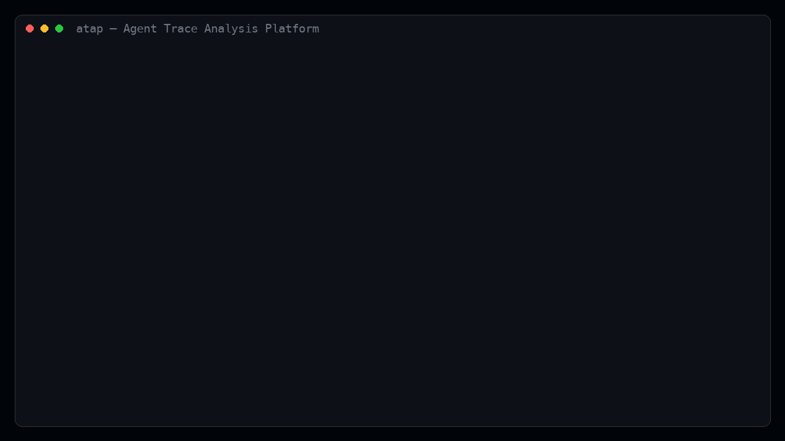

<div align="center">

# Agent Trace Analysis Platform (atap)

**Find, explain, and fix LLM-agent failures — one pluggable pipeline from raw traces to verified recovery**

[](https://github.com/aaronlyt/agent-trace-analysis-platform/actions/workflows/ci.yml)
[](https://github.com/aaronlyt/agent-trace-analysis-platform/actions/workflows/ci.yml)
[](https://github.com/aaronlyt/agent-trace-analysis-platform/releases)

[](LICENSE)

[English](README.md) | [简体中文](README.zh-CN.md)



```bash
git clone https://github.com/aaronlyt/agent-trace-analysis-platform && cd agent-trace-analysis-platform
pip install -e ".[dev,llm]"
atap demo    # offline end-to-end pipeline: FakeLLM judge, deterministic, zero network
```

**Stages & methods** — 24 algorithms across the six-stage pipeline:

[-brightgreen)](#implemented-algorithms)
[](#implemented-algorithms)
[](#implemented-algorithms)
[](#implemented-algorithms)
[](#implemented-algorithms)
[](#implemented-algorithms)

**Delivery status**:

[](#roadmap)
[](#roadmap)
[](#roadmap)
[](#roadmap)
[](#roadmap)
[](#roadmap)
[](#roadmap)
[](#roadmap)
[](#roadmap)

</div>

Agent Trace Analysis Platform (**atap**) is a pluggable framework for analyzing
the execution traces of LLM agents: it takes raw traces, **represents** them,
**analyzes and classifies** failures, **attributes** each failure to its root
cause — the responsible agent and the decisive step — then **recovers** it,
verifying the fix in a closed loop. It implements the six-stage pipeline
(collection → representation → analysis/evaluation → error classification → failure attribution → recovery)
that runs across recent agent error-analysis research — one algorithm per module,
**transformers-style**: every algorithm inherits a stage base class, registers itself in
a `Registry`, and composes into
pipelines via YAML. Algorithms talk to each other only through artifacts — never through
imports (enforced by import-invariant tests).

- **24 algorithms across 5 stages**, each faithful to a specific paper (see the table below)
- **Deterministic offline mode** — FakeLLM pseudo-judge + toy sandbox with injected faults,
  fully reproducible, zero network
- **Real LLMs** through any OpenAI-compatible API, with a per-call audit log
- **One attribution contract** — every localizer (rules, judge, graph, replay) emits the same
  `Hypothesis` structure that recovery consumes
- **Closed loop** — recovered reruns automatically re-enter analysis for verification
  (`closed_loop: true`)
- **Ingest & export** — Langfuse v3 ingestion / OTel GenAI semantic conventions, with
  field-level roundtrip equivalence and ground-truth leak guards on export

> **Disclaimer** — this project is a learning- and research-oriented implementation of
> the agent error-analysis pipeline. Validation is **limited**: acceptance numbers come
> from a toy sandbox with constructed faults, plus a small number of real-model runs
> (see [Validation status](#validation-status)); they are not benchmark results. Use it
> to learn the pipeline and the algorithms — not as production tooling or as evidence
> of real-world performance.

## How it works

```
 ① collection                     ② storage
 io/  (JSONL · Langfuse v3 · OTel GenAI)  ──▶  traces.jsonl
                                                       │
                                                       ▼
 ③ representation — represent/
 R0 canonical events · SSF saliency folding · action signatures
 IDG dependency graph · hierarchy tree · claim ledger · HCG
                                                       │   artifacts only
                                                       ▼
 ④ analysis & classification — analyze/ + classify/
 judge_eval · loop_detect · drift_detect · mast_judge · rule_pack · inducer
                                                       │   failures trigger attribution
                                                       ▼
 ⑤ attribution — attribute/                            ──▶  Hypothesis
 all_at_once · binary_search · sbfl · rg_ug · chief ·
 claim_audit · tree_diagnosis · counterfactual_replay
                                                       │
                                                       ▼
 ⑥ recovery — recover/
 targeted_rerun · feedback_injection · dover
                                                       │
      rerun traces re-enter ④ for verification  ◀─────┘   (closed_loop: true)
```

## Implemented algorithms

| Stage | Module | Method | Paper |
|---|---|---|---|
| represent | `canonical_events` | R0: flatten the span tree into a unified event stream — the single data interface for all downstream stages | AgentDebugX [2607.18754](https://arxiv.org/abs/2607.18754) |
| represent | `ssf` | R1: saliency folding with reversible placeholders + summaries, for long trajectories | TrajAudit [2605.26563](https://arxiv.org/abs/2605.26563) |
| represent | `action_signature` | R5: nine action classes + argument fingerprints + seven effect labels + anchor sets / milestones / LCS | TraceProbe [2607.06184](https://arxiv.org/abs/2607.06184) |
| represent | `idg` | R2: information dependency graph — usage edges derived directly from `refs`, zero LLM | GraphTracer [2510.10581](https://arxiv.org/abs/2510.10581) *(retracted; ideas only)* |
| represent | `hierarchy_tree` | R4: exploration = siblings / state changes = children, stage index, compact `tree.md` rendering | CodeTracer [2604.11641](https://arxiv.org/abs/2604.11641) |
| represent | `claim_ledger` | R3: six-field claim ledger from one global LLM pass | DRIFT [2606.02060](https://arxiv.org/abs/2606.02060) |
| represent | `hcg` | hierarchical causal graph — three node tiers, sub/agt/step edges, deterministic construction | CHIEF [2602.23701](https://arxiv.org/abs/2602.23701) |
| analyze | `judge_eval` | LLM-as-judge quality score + findings, few-shot | MAST [2503.13657](https://arxiv.org/abs/2503.13657) / Agent-as-a-Judge [2410.10934](https://arxiv.org/abs/2410.10934) |
| analyze | `loop_detect` | loop predicates: search loop, re-read churn, tool oscillation, redundant search — deterministic, zero LLM | TraceProbe [2607.06184](https://arxiv.org/abs/2607.06184) |
| analyze | `drift_detect` | version/data/behavior drift between control groups: shared-support PSI + support mismatch + minimum group size + collinearity dedup | system-level taxonomy [2511.19933](https://arxiv.org/abs/2511.19933) |
| classify | `mast_judge` | MAST 3 categories / 14 failure modes, vocabulary-validated; `allow_novel` residual channel | MAST [2503.13657](https://arxiv.org/abs/2503.13657) |
| classify | `rule_pack` | L0 free rules: malformed calls, no-progress loops, premature success claims, invalid output | AgentDebugX [2607.18754](https://arxiv.org/abs/2607.18754) |
| classify | `inducer` | residual clustering → new failure-mode proposals; human gate `atap taxonomy accept`, never auto-effective | AgentDebugX §3.4 [2607.18754](https://arxiv.org/abs/2607.18754) |
| attribute | `rg_ug` | L0: retrieval-gain / usage-gain (4 subtypes) from qrels set algebra + episode utility, zero LLM | search-agent diagnosis [2608.01913](https://arxiv.org/abs/2608.01913) |
| attribute | `sbfl` | L0: spectrum-based prior — γ/β/α + λ-decay-weighted Kulczynski2, cross-trace aggregation | FAMAS [2509.13782](https://arxiv.org/abs/2509.13782) |
| attribute | `all_at_once` | L1: single-pass attribution over the (SSF-folded) full trajectory | Who&When [2505.00212](https://arxiv.org/abs/2505.00212) |
| attribute | `binary_search` | L2: bisection localization, ⌈log₂n⌉ rounds, judge sees only the lower half | Who&When [2505.00212](https://arxiv.org/abs/2505.00212) |
| attribute | `claim_audit` | R3 consumer: four-level support check → expert audit → conservative backtracking → first error span | DRIFT [2606.02060](https://arxiv.org/abs/2606.02060) |
| attribute | `tree_diagnosis` | R4 consumer: tree-level localization, then stage-interval drill-down — two LLM calls | CodeTracer [2604.11641](https://arxiv.org/abs/2604.11641) |
| attribute | `chief` | HCG consumer: oracle synthesis → reverse-topological F_eval backtracking → progressive causal filtering | CHIEF [2602.23701](https://arxiv.org/abs/2602.23701) |
| attribute | `counterfactual_replay` | L3 final review: candidate-step message-intervention replay (k=3 window) filters spurious causality; adjusted verdicts `supersede` upstream hypotheses | TraceElephant [2604.22708](https://arxiv.org/abs/2604.22708) |
| recover | `targeted_rerun` | keep the prefix, rerun from t* with the fix as feedback, ≤5 rounds | AgentDebug [2509.25370](https://arxiv.org/abs/2509.25370) |
| recover | `feedback_injection` | attribution reflection injected into a full re-solve, 3 rounds | AgenTracer [2509.03312](https://arxiv.org/abs/2509.03312) |
| recover | `dover` | do-then-verify: trial split → minimal message intervention → in-place replay ×3 → milestone diff, four verdicts | DoVer [2512.06749](https://arxiv.org/abs/2512.06749) |

Companion infrastructure:

- `sandbox/` — a toy research-QA environment (planner → searcher → reporter) with mock
  retrieval corpus, two-level qrels (E/G), a verifier, six injected faults + two extended
  faults, and a drift-corpus generator. Ground truth is known by construction
  (AgenTracer route-B idea).
- `llm/` — `FakeLLM`, a deterministic pseudo-judge that rules on judge-visible text only
  (never reads ground truth), plus an OpenAI-compatible client and the shared call auditor.

## Installation

atap is currently distributed as a **local install from source** (a PyPI package may come
later). Requires **Python ≥ 3.10** (developed and tested on 3.12).

```bash
git clone https://github.com/aaronlyt/agent-trace-analysis-platform
cd agent-trace-analysis-platform
```

With [uv](https://docs.astral.sh/uv/) (recommended):

```bash
uv venv .venv --python 3.12
uv pip install -e ".[dev,llm]"
```

Or with plain pip:

```bash
python3 -m venv .venv
source .venv/bin/activate     # Windows: .venv\Scripts\activate
pip install -e ".[dev,llm]"
```

Extras: base install pulls `pyyaml` + `pydantic` only; `llm` adds the `openai` client
(needed for real-model runs), `dev` adds `pytest`. Everything offline (FakeLLM) works
without the `llm` extra.

## Quick start

```bash
# 1) list all registered algorithms
atap list

# 2) offline end-to-end demo — FakeLLM, deterministic, zero network (seed=7)
atap demo
```

`atap demo` runs the full pipeline on 7 sandbox trajectories (1 success + 6 injected
faults) and prints, for each fault, whether attribution hit the ground-truth step/agent
and whether recovery was verified:

```
attribution hits: step 6/6  agent 6/6  MAST 6/6  recovery 6/6
round0: traces=7 failures=6 attributed=6 reruns=6(ok=6)
round1: traces=6 failures=0 attributed=0 reruns=0(ok=0)
artifacts directory: runs/demo/artifacts (report.json + per-trajectory per-stage JSON)
```

Then explore the runnable configurations:

```bash
# same stack as the demo, driven by a config file
atap run --config configs/pipeline_offline.yaml

# stage-3 stack: bisection + loop predicates + L0 rule pack + feedback injection
# on a 24-trace spectrum corpus
atap corpus --out runs/corpus/traces.jsonl
atap run --config configs/pipeline_offline_v3.yaml --out runs/v3

# compare two algorithm stacks on the same trajectory set
atap compare --config configs/pipeline_offline_v3.yaml \
             --config configs/pipeline_sbfl.yaml --out runs/compare

# stage-4 deterministic layer (IDG + hierarchy tree + RG/UG + drift + inducer)
atap run --config configs/pipeline_offline_v4.yaml --out runs/v4

# drift monitoring corpus (three constructed drift scenarios)
atap corpus --drift --out runs/drift/traces.jsonl
atap run --config configs/pipeline_drift.yaml --out runs/drift

# L3 recovery closed loop (DoVer) and counterfactual replay
atap run --config configs/pipeline_dover.yaml --out runs/dover
atap run --config configs/pipeline_cf_replay.yaml --out runs/cf_replay

# export traces for Langfuse (v3 ingestion) or OTel (GenAI semconv)
atap export --traces runs/corpus/traces.jsonl --format langfuse --out runs/export.json

# DEBUG-level process logs (default INFO)
atap -v run --config configs/pipeline_offline.yaml
```

### Real LLM runs

Any OpenAI-compatible endpoint works. Keys are read from environment variables only —
never written to disk.

```bash
export OPENAI_API_KEY=sk-...                     # required
export OPENAI_BASE_URL=https://openrouter.ai/api/v1   # optional (default: OpenAI)
atap run --config configs/pipeline_llm.yaml
```

`configs/` also contains the `final_*` (full pre-release test matrix) and `realtest_*`
(smoke variants for specific models) configurations used to produce the real-model
numbers below.

### Auditing and logs

Every `run` / `demo` / `compare` writes two records under `runs/<name>/`:

- `run.log` — process log (stage timings, acceptance numbers); `-v` switches to DEBUG;
- `llm_calls.jsonl` — **one audit record per LLM call**: timestamp, client, tag, model,
  schema, latency, full prompt messages, response, token usage, error info. Fake and real
  clients share the same auditor.

```bash
python -c "import json,collections; \
recs=[json.loads(l) for l in open('runs/demo/llm_calls.jsonl')]; \
print(len(recs), dict(collections.Counter(r['tag'] for r in recs)))"
```

## Configuration — the pluggable core

Pipelines are plain YAML; algorithms are referenced by registered name and can take params:

```yaml
run_name: offline-full-pipeline
seed: 7
source: {type: jsonl, path: runs/demo/traces.jsonl}
llm: {type: fake}          # or {type: openai, model: ..., temperature: 0.0}
sandbox: {type: toy}
closed_loop: true          # recover outputs flow back to analyze for verification

stages:
  represent:
    - canonical_events
    - ssf                  # add/swap an algorithm = one line
  analyze:
    - judge_eval
  classify:
    - mast_judge
  attribute:
    - all_at_once
  recover:
    - name: targeted_rerun
      params: {max_rounds: 5}
```

### Adding your own algorithm

One module under the stage package, subclass the stage base, decorate with `@register` —
zero core changes, and it shows up in `atap list`:

```python
# src/attribute/my_attributor.py
from atap.attribute.base import Attributor
from atap.core.registry import register
from atap.core.schema import Hypothesis


@register
class MyAttributor(Attributor):        # stage = "attribute" is set by the base class
    name = "my_attributor"

    def run_one(self, bundle, ctx):
        if bundle.succeeded:
            return                      # detection ≠ attribution
        self.emit(bundle, [Hypothesis(
            agent="reporter", step=3,
            root_cause="…", root_cause_code="FM-1.3",
            evidence=["event-3 …"], fix_suggestion="…", confidence=0.6,
        )])                             # writes artifacts["attribute"]["my_attributor"]
```

## Key contracts

- **R0 event model** (`core/schema.py`): `TraceEvent(kind/agent/action/payload/refs/phase/parent/index)` —
  the representation layer is the only data interface for analysis and attribution;
- **Unified attribution output**: `Hypothesis(agent, step, root_cause, root_cause_code,
  responsible_side, evidence, fix_suggestion, confidence)` — produced by every L0~L3
  attribution algorithm, consumed only by recovery;
- **Dual scope**: `run_one` (single trajectory) / `run_corpus` (cross-trajectory
  aggregation — used by spectrum and clustering algorithms);
- **Detection ≠ attribution**: analyze discovers symptoms; attribution runs on failures;
  recovery outputs automatically return to analyze for verification (`closed_loop: true`).

## Layered invariants (enforced by `tests/test_invariants.py`)

- `core/` contains zero algorithms and zero I/O — interfaces only;
- algorithm modules must not import other stage packages (sole exception: the shared
  `classify/taxonomy` vocabulary) nor `sandbox/runtime/cli`;
- `llm/` and `io/` depend on no stage package; `sandbox/` depends only on `core`;
- every registered class's `stage` must match its owning package.

## Validation status

**Offline (FakeLLM, deterministic).** 332 tests pass in under a second, including the
offline end-to-end pipeline, replay-integrity invariants, and leak-guard regressions.
Representative acceptance numbers on the sandbox corpora:

| Stack | Corpus | Offline result |
|---|---|---|
| demo (SSF + all-at-once + targeted rerun) | 7 traces, 6 injected faults | step 6/6 · agent 6/6 · MAST 6/6 · recovery 6/6; closed-loop round 1: 0 failures |
| v3 (bisection + rules + feedback injection) | 18-fault corpus | step 15/18 · 141 LLM calls (vs SBFL 12/18 · 42 calls on the same corpus) |
| rg_ug (deterministic, zero LLM) | 18-fault corpus | step 15/18 · agent 15/18 |
| chief | 18-fault corpus | step 18/18 · agent 18/18 |
| tree_diagnosis / claim_audit | 18-fault corpus | 18/18 · 36 calls / 12/18 (two misses are documented method boundaries) |
| dover | 18-fault corpus | recovery 18/18; closed-loop improvement 18/18 |
| counterfactual_replay | 18-fault corpus | 15 validated / 3 refuted — the refuted three are exactly bisection's known mislocalizations |

**Real LLMs** (pre-release full test: `deepseek-v4-flash` direct, 8 config tiers, 594
audited calls, zero judge-prompt leaks, human spot-check found no hallucination; report
in [docs/audit_上线前真实测试_2026-08-25.md](docs/audit_上线前真实测试_2026-08-25.md)):

- smoke stack: step 6/6 · agent 6/6 · recovery 6/6
- **chief: step 17/18 · agent 18/18 — the best real-model localizer**
- claim coverage 14/18; tree diagnosis 14/18; dover recovery 18/18; v3 closed loop 18/18
- binary_search 3/18 — well below its 15/18 offline baseline (judge lower-half bias on
  short trajectories; a judge-capability limit, not a pipeline defect — demoted to
  auxiliary use)

> **Read the offline numbers correctly.** The offline sandbox decides "fault removed" by
> keyword-matching the judge's fix suggestion against the injected fault name, so offline
> recovery and replay-verdict numbers are deterministic functions of attribution hits.
> They prove the pipeline contract (hypothesis → feedback → replay → verification), not
> judge capability. For the same reason, offline *cross-algorithm* comparisons measure how
> much information the deterministic pseudo-judge exposes per algorithm, not algorithm
> superiority. The real-model numbers above are the meaningful ones.

## Project layout

```
src/
  core/        # registry · pipeline · schema · config — zero algorithms, zero I/O
  represent/   # R0–R5 trajectory representations
  analyze/     # symptom discovery: judge, loop predicates, drift detection
  classify/    # MAST labeling · L0 rule pack · residual-mode inducer
  attribute/   # L0–L3 failure attribution (cost ladder)
  recover/     # targeted rerun · feedback injection · do-then-verify
  llm/         # FakeLLM pseudo-judge · OpenAI-compatible client · call auditor
  io/          # JSONL store · Langfuse / OTel adapters · export leak guard
  sandbox/     # toy research-QA environment with fault injection and drift corpora
configs/       # runnable pipeline configurations (offline · LLM · realtest · final)
tests/         # 332 tests: e2e, invariants, leak regressions, replay integrity
docs/          # plans · audit reports · dev log
```

## Roadmap

- [x] Phase 4A — deterministic layer: `idg` / `hierarchy_tree` / `rg_ug` / `drift_detect` / `inducer` + taxonomy accept
- [x] Phase 4B — LLM representation & attribution: `claim_ledger`+`claim_audit` (DRIFT), `tree_diagnosis` (CodeTracer), `hcg`+`chief` (CHIEF)
- [x] Phase 4C — L3 counterfactual replay: sandbox `replay_intervene`, `counterfactual_replay` (TraceElephant), `dover` (DoVer)
- [x] Phase 4D — collection adapters: Langfuse v3 ingestion, OTel GenAI semconv, `atap export` + roundtrip
- [ ] fuse SBFL as an L2 prior (currently a standalone algorithm); AgenTracer-style GRPO fine-tuned tracer
- [ ] sandbox evolution — grow the toy research-QA sandbox into more realistic multi-scenario execution environments (richer task types, real tool calls, broader fault injection)
- [ ] real-dataset evaluation — validate the pipeline on public real agent-trajectory datasets/benchmarks, replacing constructed-corpus acceptance numbers

Detailed plans: [docs/plan.md](docs/plan.md) · [docs/plan_阶段四.md](docs/plan_阶段四.md) ·
development log: [docs/README_dev_log.md](docs/README_dev_log.md)
