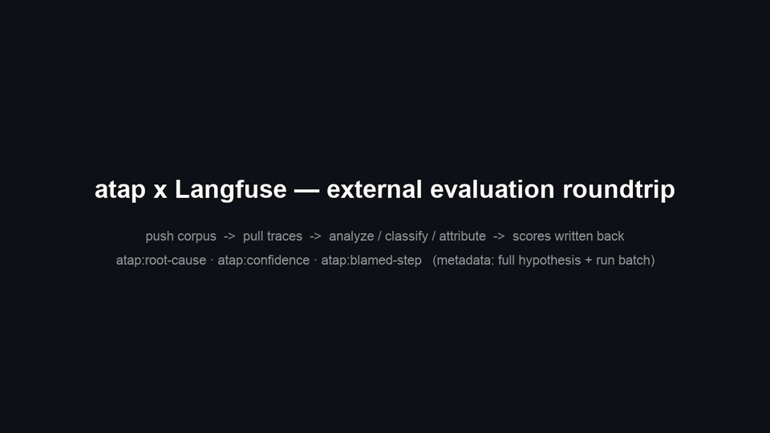
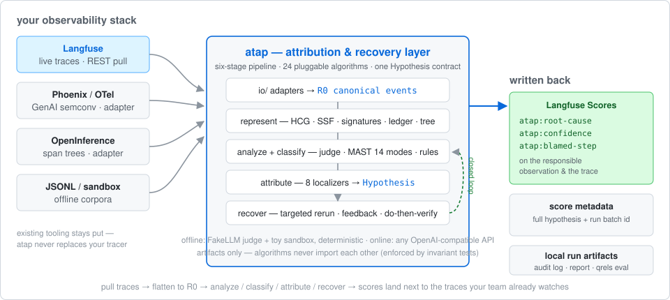

<div align="center">

# Agent Trace Analysis Platform（atap）

**架在你现有 Agent 可观测性栈（如 Langfuse）之上的归因与恢复层 —— 定位、解释并修复 LLM Agent 失败，把结论作为 Score 写回原处**

[](https://github.com/aaronlyt/agent-trace-analysis-platform/actions/workflows/ci.yml)
[](https://github.com/aaronlyt/agent-trace-analysis-platform/actions/workflows/ci.yml)
[](https://github.com/aaronlyt/agent-trace-analysis-platform/releases)

[](LICENSE)

[English](README.md) | **简体中文**



<sub>atap × Langfuse：推送语料 → 拉取活轨迹 → 分析/分类/归因 → 根因码 + 置信度 + 被归因步标记作为 Score 写回（纯终端演示见 `docs/assets/demo.gif`）</sub>



```bash
git clone https://github.com/aaronlyt/agent-trace-analysis-platform && cd agent-trace-analysis-platform
pip install -e ".[dev,llm]"
atap demo    # 离线端到端流水线：FakeLLM 伪判官、确定性、零网络
```

<sub><b>阶段与方法 —— 24 个算法</b></sub>

[](docs/算法清单.md) [](docs/算法清单.md) [](docs/算法清单.md)

[](docs/算法清单.md) [](docs/算法清单.md) [](docs/算法清单.md)

</div>

Agent Trace Analysis Platform（**atap**）不是又一个追踪平台——它是**架在你已有
可观测性栈之上的归因与恢复层**：数据来自运行中的 Langfuse 实例，或普通的
JSONL / OTel / Phoenix 导出。

拉取的轨迹被拍平成统一事件流，跑近年 agent 错误分析研究通行的六环节
流水线——**表征 → 分析评测 → 错误分类 → 失败归因 → 恢复闭环**。

结论写回团队本来就看得见的地方：

- **trace 上**——Langfuse score 携带根因码与置信度；
- **被归因的 observation 上**——blamed-step 标记；
- **score metadata 里**——完整假设与运行批次标识。

流水线是 **transformers 式可插拔**：每个算法一个模块、继承阶段基类、注册进
Registry、YAML 配置组合 pipeline；算法之间只通过产物（artifact）解耦，不互相
import（由 import 图不变量测试强制）。

- **5 个阶段 24 个算法**，每个都忠实对应一篇文献——完整表格见
  [docs/算法清单.md](docs/算法清单.md)（[English](docs/algorithms.md)）
- **确定性离线模式** —— FakeLLM 伪判官 + 注入故障的玩具沙盒，完全可复现、零网络
- **真实 LLM** —— 任意 OpenAI 兼容 API，逐调用审计日志
- **统一归因契约** —— 规则/判官/图/重放等一切定位算法产出同一个 `Hypothesis` 结构，恢复阶段只消费它
- **恢复闭环** —— 恢复产物自动回到分析阶段验证（`closed_loop: true`）
- **采集适配** —— Langfuse v3 ingestion / OTel GenAI 语义约定导入导出，roundtrip 字段级等价，导出侧防 GT 泄漏
- **活实例外部评估** —— `atap langfuse-eval` 从运行中的 Langfuse 拉取 trace，把归因结果作为 Score 写回原 trace（trace 级根因码 + 置信度，被归因步骤的 observation 上打 blamed-step 标记）；重复评估可按 score metadata 区分批次（`run_id` / `llm` / 完整假设字段）

> **声明** —— 本项目是对 agent 错误分析流程的学习/研究性质实现。**测试有限**：
> 验收数字来自构造故障的玩具沙盒语料与少量真实模型轮次（见[验证状态](#验证状态)），
> 不构成基准测试结论。请将其用于学习管线与算法机制，请勿用于生产环境，也不宜
> 作为真实场景性能的依据。

## 整体流程

```
 ①采集                             ②存储
 io/（JSONL · Langfuse v3 · OTel GenAI · 活实例 API） ──▶  traces.jsonl
                                                   │
                                                   ▼
 ③表征 — represent/
 R0 事件化 · SSF 显著性折叠 · 动作签名
 IDG 依赖图 · 层级树 · 主张台账 · 层次因果图
                                                   │   只经产物传递
                                                   ▼
 ④分析评测 + 分类打标 — analyze/ + classify/
 judge_eval · loop_detect · drift_detect · mast_judge · rule_pack · inducer
                                                   │   失败触发归因
                                                   ▼
 ⑤归因 — attribute/                                ──▶  Hypothesis
 all_at_once · binary_search · sbfl · rg_ug ·
 chief · claim_audit · tree_diagnosis · counterfactual_replay
                                                   │
                                                   ▼
 ⑥恢复 — recover/
 targeted_rerun · feedback_injection · dover
                                                   │
      重跑轨迹回到 ④ 闭环验证              ◀─────┘   （closed_loop: true）
```

完整算法表格（24 个算法、每个对应一篇文献）与配套基础设施说明移至
**[docs/算法清单.md](docs/算法清单.md)**（[English](docs/algorithms.md)）。

## 安装

当前发布方式为**本地源码安装**（后续可能提供 PyPI 包）。要求 **Python ≥ 3.10**
（在 3.12 上开发与测试）。

```bash
git clone https://github.com/aaronlyt/agent-trace-analysis-platform
cd agent-trace-analysis-platform
```

使用 [uv](https://docs.astral.sh/uv/)（推荐）：

```bash
uv venv .venv --python 3.12
uv pip install -e ".[dev,llm]"
```

或使用 pip：

```bash
python3 -m venv .venv
source .venv/bin/activate     # Windows: .venv\Scripts\activate
pip install -e ".[dev,llm]"
```

依赖说明：基础安装只拉取 `pyyaml` + `pydantic`；`llm` 额外安装 `openai` 客户端
（真实模型运行需要）；`dev` 额外安装 `pytest`。离线（FakeLLM）功能不依赖 `llm`。

## 快速开始

```bash
# 1) 列出全部注册算法
atap list

# 2) 离线全链路演示 —— FakeLLM，确定性，零网络（seed=7）
atap demo
```

`atap demo` 在 7 条沙盒轨迹（1 成功 + 6 注入故障）上跑完整管线，逐故障打印
归因是否命中 GT 的 step/agent、恢复是否通过闭环验证：

```
attribution hits: step 6/6  agent 6/6  MAST 6/6  recovery 6/6
round0: traces=7 failures=6 attributed=6 reruns=6(ok=6)
round1: traces=6 failures=0 attributed=0 reruns=0(ok=0)
artifacts directory: runs/demo/artifacts (report.json + per-trajectory per-stage JSON)
```

再试各档可运行配置：

```bash
# 与 demo 同栈，由配置文件驱动
atap run --config configs/pipeline_offline.yaml

# 阶段三栈：二分定位 + 循环谓词 + L0 规则包 + 反馈注入（频谱语料 24 条）
atap corpus --out runs/corpus/traces.jsonl
atap run --config configs/pipeline_offline_v3.yaml --out runs/v3

# 同一轨迹集上对比两套算法组合
atap compare --config configs/pipeline_offline_v3.yaml \
             --config configs/pipeline_sbfl.yaml --out runs/compare

# 阶段四确定性层（IDG + 层级树 + RG/UG + 漂移 + inducer）
atap run --config configs/pipeline_offline_v4.yaml --out runs/v4

# 漂移监控语料（三类构造漂移场景）
atap corpus --drift --out runs/drift/traces.jsonl
atap run --config configs/pipeline_drift.yaml --out runs/drift

# L3 恢复闭环（DoVer）与反事实重放
atap run --config configs/pipeline_dover.yaml --out runs/dover
atap run --config configs/pipeline_cf_replay.yaml --out runs/cf_replay

# 导出为 Langfuse（v3 ingestion）或 OTel（GenAI semconv）格式
atap export --traces runs/corpus/traces.jsonl --format langfuse --out runs/export.json

# 过程日志 DEBUG 级（默认 INFO）
atap -v run --config configs/pipeline_offline.yaml
```

### 真实 LLM 运行

任意 OpenAI 兼容端点均可。密钥只从环境变量读取，绝不落盘：

```bash
export OPENAI_API_KEY=sk-...                     # 必需
export OPENAI_BASE_URL=https://openrouter.ai/api/v1   # 可选（默认 OpenAI）
atap run --config configs/pipeline_llm.yaml
```

`configs/` 中另有产出下述真实模型数字所用的 `final_*`（上线前全量测试八档）与
`realtest_*`（特定模型冒烟档）配置。

### 外部评估：把归因结果写回 Langfuse

atap 可以作为**活 Langfuse 实例的外部评估管线**：按标签/时间窗拉取 trace，
跑你的分析/分类/归因栈，再把结果作为 Score 写回原 trace——失败归因直接出现在
你自己的 Langfuse 面板上。

```bash
pip install -e ".[llm,langfuse]"
export LANGFUSE_BASE_URL=... LANGFUSE_PUBLIC_KEY=... LANGFUSE_SECRET_KEY=...
atap langfuse-eval --config configs/langfuse_eval.yaml --out runs/lf1 \
    --tags production --since 24h --dry-run    # 先空跑确认，去掉该旗标即真写
```

`--dry-run` 只打印将写入的 score、不发任何请求；此前批次已完整评估的 trace
自动跳过（trace 级 `atap:root-cause` 最后写入、充当完成标记，被打断的半批次
下次自动重评；`--force` 无条件重评）。凭据只从环境变量读取。自建演示实例与
完整 round-trip 演示（`atap langfuse-push` 播种 → 评估 → 面板查看 score）见
[docs/集成指南_Langfuse.md](docs/集成指南_Langfuse.md) 与
`docker-compose.langfuse.yml`。

### 日志与调用审计

每次 `run / demo / compare` 在 `runs/<name>/` 下自动落两份记录：

- `run.log` —— 过程日志（各阶段耗时、验收数字）；`-v` 开 DEBUG；
- `llm_calls.jsonl` —— **每次 LLM 调用一条审计记录**：时间戳、client、tag、
  model、schema、延迟、完整 prompt messages、response、token 用量、错误信息。
  Fake 与真实客户端共用同一审计挂件。

```bash
python -c "import json,collections; \
recs=[json.loads(l) for l in open('runs/demo/llm_calls.jsonl')]; \
print(len(recs), dict(collections.Counter(r['tag'] for r in recs)))"
```

## 配置组合 —— 可插拔的核心

Pipeline 即普通 YAML；算法按注册名引用，可带参数：

```yaml
run_name: offline-full-pipeline
seed: 7
source: {type: jsonl, path: runs/demo/traces.jsonl}
llm: {type: fake}          # 或 {type: openai, model: ..., temperature: 0.0}
sandbox: {type: toy}
closed_loop: true          # 恢复产物自动回到分析阶段验证

stages:
  represent:
    - canonical_events
    - ssf                  # 换成/追加新算法只需写一行
  analyze:
    - judge_eval
  classify:
    - mast_judge
  attribute:
    - all_at_once
  recover:
    - name: targeted_rerun
      params: {max_rounds: 5}
```

### 新增自己的算法

在对应 stage 包下写一个模块：继承阶段基类，加 `@register`——零改核心，
`atap list` 即见：

```python
# src/attribute/my_attributor.py
from atap.attribute.base import Attributor
from atap.core.registry import register
from atap.core.schema import Hypothesis


@register
class MyAttributor(Attributor):        # stage = "attribute" 由基类声明
    name = "my_attributor"

    def run_one(self, bundle, ctx):
        if bundle.succeeded:
            return                      # 检测 ≠ 归因
        self.emit(bundle, [Hypothesis(
            agent="reporter", step=3,
            root_cause="…", root_cause_code="FM-1.3",
            evidence=["event-3 …"], fix_suggestion="…", confidence=0.6,
        )])                             # 写入 artifacts["attribute"]["my_attributor"]
```

## 关键契约

- **R0 事件模型**（`core/schema.py`）：`TraceEvent(kind/agent/action/payload/refs/
  phase/parent/index)` —— 表征层是分析/归因的唯一数据接口；
- **统一归因输出**：`Hypothesis(agent, step, root_cause, root_cause_code,
  responsible_side, evidence, fix_suggestion, confidence)` —— L0~L3 任何归因算法
  都产出此结构，恢复阶段只消费它；
- **双作用域**：`run_one`（单轨迹）/ `run_corpus`（跨轨迹聚合——频谱与聚类类
  算法使用）；
- **检测 ≠ 归因 / 闭环**：analyze 只发现症状，attribute 由失败触发，recover
  产物自动回到 analyze 验证（`closed_loop: true`）。

## 分层不变量（tests/test_invariants.py 强制）

- `core/` 零算法、零 I/O 实现（只允许接口协议）；
- 算法模块不得 import 其它 stage 包（唯一例外：`classify/taxonomy` 共享词表）、
  不得 import sandbox/runtime/cli；
- `llm/ io/` 不依赖 stage 包；`sandbox/` 只依赖 core；
- 注册表内所有类的 stage 必须与其所在包一致。

## 验证状态

**离线（FakeLLM，确定性）。** 332 个测试一秒内全绿，含离线全链路 e2e、重放
完整性不变量与防泄漏回归。沙盒语料上的代表性验收数字：

| 栈 | 语料 | 离线结果 |
|---|---|---|
| demo（SSF + 单遍归因 + 定向重跑） | 7 条轨迹、6 注入故障 | step 6/6 · agent 6/6 · MAST 6/6 · 恢复 6/6；闭环 round1 失败 0 |
| v3（二分 + 规则包 + 反馈注入） | 18 故障语料 | step 15/18 · 141 次调用（同语料 SBFL 12/18 · 42 次调用） |
| rg_ug（确定性，零 LLM） | 18 故障语料 | step 15/18 · agent 15/18 |
| chief | 18 故障语料 | step 18/18 · agent 18/18 |
| tree_diagnosis / claim_audit | 18 故障语料 | 18/18 · 36 次调用 / 12/18（两例 honest miss 为已记录的方法边界） |
| dover | 18 故障语料 | 恢复 18/18；闭环改善 18/18 |
| counterfactual_replay | 18 故障语料 | 15 validated / 3 refuted——被标伪的 3 例恰为二分的已知错步 |

**真实 LLM**（上线前全量测试：deepseek-v4-flash 直连、8 档配置、594 次审计调用、
判官 prompt 零泄漏、人工抽检无幻觉；报告见
[docs/audit_上线前真实测试_2026-08-25.md](docs/audit_上线前真实测试_2026-08-25.md)）：

- 冒烟栈：step 6/6 · agent 6/6 · 恢复 6/6；
- **chief：step 17/18 · agent 18/18——真实模型最佳定位器**；
- claim 覆盖 14/18；tree 14/18；dover 恢复 18/18；v3 闭环 18/18；
- binary_search 3/18——远低于其离线基线 15/18（短轨迹下判官 lower-half 偏置，
  属判官能力上限而非管线缺陷，建议降级辅助使用）。

> **离线数字请正确解读。** 离线沙盒按"判官修复文案是否命中注入故障名"判定
> "故障已移除"，因此离线恢复率与重放判决是归因命中的确定性函数：它们证明的是
> 管线契约（假设 → 反馈 → 重放 → 验证）正确，而非判官能力。同理，离线的
> **跨算法对比**量的是确定性伪判官对各算法暴露的信息量差异，不构成算法优劣
> 证据。真实模型数字才是衡量能力的口径。

## 项目结构

```
src/
  core/        # 注册表 · pipeline · schema · 配置 —— 零算法、零 I/O
  represent/   # R0–R5 轨迹表征
  analyze/     # 症状发现：判官评测、循环谓词、漂移检测
  classify/    # MAST 打标 · L0 规则包 · 残差模式 inducer
  attribute/   # L0–L3 失败归因（成本阶梯）
  recover/     # 定向重跑 · 反馈注入 · do-then-verify
  llm/         # FakeLLM 伪判官 · OpenAI 兼容客户端 · 调用审计
  io/          # JSONL 存储 · Langfuse/OTel 适配器 · 活实例桥接 · 导出防泄漏
  sandbox/     # 玩具研究问答沙盒（故障注入 + 漂移语料）
configs/       # 可运行配置（offline · LLM · realtest · final）
tests/         # 332 个测试：e2e · 不变量 · 防泄漏回归 · 重放完整性
docs/          # 计划 · 审计报告 · 开发日志
```

## 路线图

- [x] 阶段四A 确定性层：`idg` / `hierarchy_tree` / `rg_ug` / `drift_detect` / `inducer` + taxonomy accept
- [x] 阶段四B LLM 表征与归因升级：`claim_ledger`+`claim_audit`（DRIFT）、`tree_diagnosis`（CodeTracer）、`hcg`+`chief`（CHIEF）
- [x] 阶段四C L3 反事实重放：沙盒 `replay_intervene` 基建、`counterfactual_replay`（TraceElephant）、`dover`（DoVer）
- [x] 阶段四D 采集适配器：Langfuse v3 ingestion、OTel GenAI semconv、`atap export` + roundtrip
- [x] 阶段四E 活实例桥接：`atap langfuse-eval`（拉取 → 流水线 → Score 回写）+ `atap langfuse-push`
- [ ] SBFL 作为 L2 先验的实际融合（当前为独立算法）；AgenTracer 式 GRPO 微调 tracer
- [ ] 沙盒演进 —— 从玩具研究问答沙盒走向更真实的多场景执行环境（更丰富的任务类型、真实工具调用、更多故障注入）
- [ ] 真实数据集评测 —— 在公开的真实 agent 轨迹数据集/基准上验证管线，替代构造语料的验收数字

详细计划：[docs/plan.md](docs/plan.md) · [docs/plan_阶段四.md](docs/plan_阶段四.md) ·
算法清单：[docs/算法清单.md](docs/算法清单.md) ·
集成指南：[docs/集成指南_Langfuse.md](docs/集成指南_Langfuse.md) ·
开发日志：[docs/README_dev_log.md](docs/README_dev_log.md)
